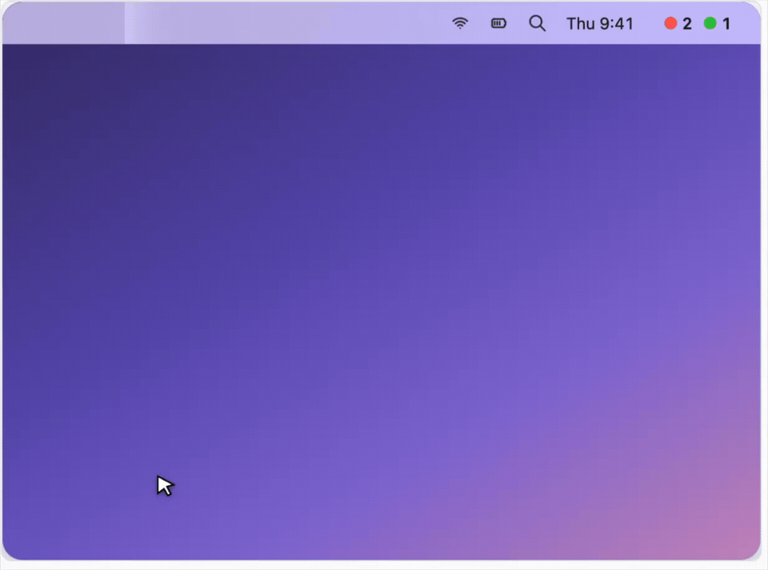

# Claude Code Status Monitor

A macOS menu-bar indicator for everyone who runs **multiple Claude Code sessions in parallel** and keeps losing track of which one is working, which is done, and which is quietly waiting for input.

One colored dot per session, always visible:

| | |
|---|---|
| 🔴 | working |
| 🟠 | waiting for you (a permission prompt, or a question) |
| 🟢 | done |

Click a session in the dropdown to jump straight to its window.



## How it works

It's **not polling or screen-scraping**. Claude Code emits lifecycle [hooks](https://code.claude.com/docs/en/hooks) — prompt submitted, tool about to run, permission requested, turn finished. A tiny reporter writes one status file per session; a [SwiftBar](https://swiftbar.app) plugin reads them and paints the dots. Ground truth, near-zero overhead, and it works the same whether you run Claude Code in the **desktop app or a terminal**.

- **`reporter.py`** — invoked by the hooks; writes `~/.claude/status/<session_id>.json`.
- **`merge-hooks.py`** — merges the hooks into your `~/.claude/settings.json` (idempotent, backs up).
- **`claude_status.2s.py`** — the SwiftBar plugin that draws the menu bar.
- **`open-session.sh`** — the click handler that focuses a session's window.

## Install (one command)

Requirements: macOS, [Homebrew](https://brew.sh), and `/usr/bin/python3` (ships with macOS).

```bash
git clone https://github.com/Zeev-L/claude-status-monitor.git
bash claude-status-monitor/install.sh
```

`install.sh` is self-contained and idempotent: it links the scripts, **merges the status hooks into your `settings.json`** (preserving anything already there, with a backup), installs SwiftBar, and launches it. Open a Claude Code session and look at the top-right of your menu bar.

## Behavior

- **Working sessions** (🔴/🟠) are always shown.
- **Finished sessions** (🟢) fade out after 5 minutes — except the most recent one, so the bar is never empty.
- Closing a session removes it immediately; an abandoned session is cleaned up after 6h.
- Session names match the titles shown in the desktop app's sidebar (terminal sessions fall back to the project folder).

Tunable at the top of `claude_status.2s.py`: `DONE_KEEP_SECS`, `STALE_RUNNING_SECS`, `PRUNE_SECS`.

## Limitations

- **macOS only** (the display layer is SwiftBar).
- **Click-to-focus**: exact-window on the desktop app (each session is its own app instance); in a terminal it brings the terminal app to the front, not the exact tab.
- **macOS permission dialogs** (e.g. "allow access to Desktop") stay 🔴 — they're an OS dialog, not a Claude Code event, so no hook fires.
- claude.ai chat / web is out of scope (no hooks).

## Uninstall

```bash
brew uninstall --cask swiftbar
```
Then remove the `reporter.py` hook entries from `~/.claude/settings.json` (or restore a `settings.json.bak.*`), and delete `~/.claude/status-monitor` and `~/.claude/status`.

## License

MIT — see [LICENSE](LICENSE).
